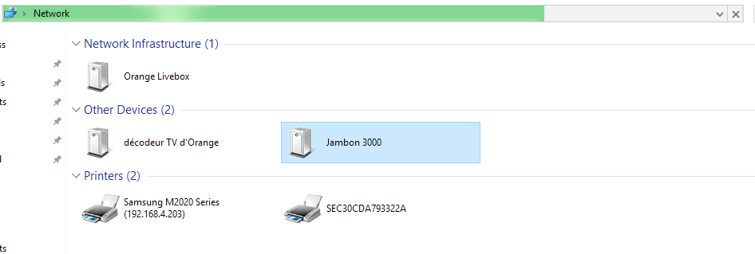

# Python UPnP Example

## Introduction

This code implements a SSDP server and a HTTP server, in order to notify the network that a device is here.

The base of this code was the [SSDP module](https://github.com/palfrey/coherence/blob/master/coherence/upnp/core/ssdp.py) of [coherence](http://coherence.beebits.net) .
I took it, converted it to Python 3, and kept only the interesting parts for this project: the parts that responds to `MSEARCH` queries.
 

## Technical details

First, a SSDP client will try to search devices on the network by issuing
a `MSEARCH *` query:

    M-SEARCH * HTTP/1.1
    HOST:239.255.255.250:1900
    ST:upnp:rootdevice
    MX:2
    MAN:"ssdp:discover"

`lib/ssdp.py` will handle it and reply with a `200`:

    HTTP/1.1 200 OK
    SERVER: ZeWaren example SSDP Server
    LOCATION: http://192.168.4.207:8088/jambon-3000.xml
    USN: uuid:e427ce1a-3e80-43d0-ad6f-89ec42e46363::upnp:rootdevice
    CACHE-CONTROL: max-age=1800
    EXT: 
    last-seen: 1477147409.432466
    ST: upnp:rootdevice
    DATE: Sat, 22 Oct 2016 14:44:26 GMT

The client will then fetch the device description:

    GET /jambon-3000.xml HTTP/1.1
    Cache-Control: no-cache
    Connection: Keep-Alive
    Pragma: no-cache
    Accept: text/xml, application/xml
    User-Agent: FDSSDP
    Host: 192.168.4.207:8088

And `lib/upnp_http_server.py` will build and serve that file:

    HTTP/1.0 200 OK
    Server: BaseHTTP/0.6 Python/3.4.3
    Date: Sat, 22 Oct 2016 14:44:26 GMT
    Content-type: application/xml
    
    <root>
        <specVersion>
            <major>1</major>
            <minor>0</minor>
        </specVersion>
        <device>
            <deviceType>urn:schemas-upnp-org:device:Basic:1</deviceType>
            <friendlyName>Jambon 3000</friendlyName>
            <manufacturer>Boucherie numrique SAS</manufacturer>
            <manufacturerURL>http://www.boucherie.example.com/</manufacturerURL>
            <modelDescription>Jambon Appliance 3000</modelDescription>
            <modelName>Jambon</modelName>
            <modelNumber>3000</modelNumber>
            <modelURL>http://www.boucherie.example.com/en/prducts/jambon-3000/</modelURL>
            <serialNumber>JBN425133</serialNumber>
            <UDN>uuid:e427ce1a-3e80-43d0-ad6f-89ec42e46363</UDN>
            <serviceList>
                <service>
                    <URLBase>http://xxx.yyy.zzz.aaaa:5000</URLBase>
                    <serviceType>urn:boucherie.example.com:service:Jambon:1</serviceType>
                    <serviceId>urn:boucherie.example.com:serviceId:Jambon</serviceId>
                    <controlURL>/jambon</controlURL>
                    <eventSubURL/>
                    <SCPDURL>/boucherie_wsd.xml</SCPDURL>
                </service>
            </serviceList>
            <presentationURL>http://192.168.4.207:5000/</presentationURL>
        </device>
    </root>

The client now knows (nearly) everything about the device.

## Relevant links

 * UPnP™ Device Architecture 1.1 (UPnP forum, October 15, 2008): http://upnp.org/specs/arch/UPnP-arch-DeviceArchitecture-v1.1.pdf
 * Coherence - DLNA/UPnP framework for the digital living:  https://pypi.python.org/pypi/Coherence
